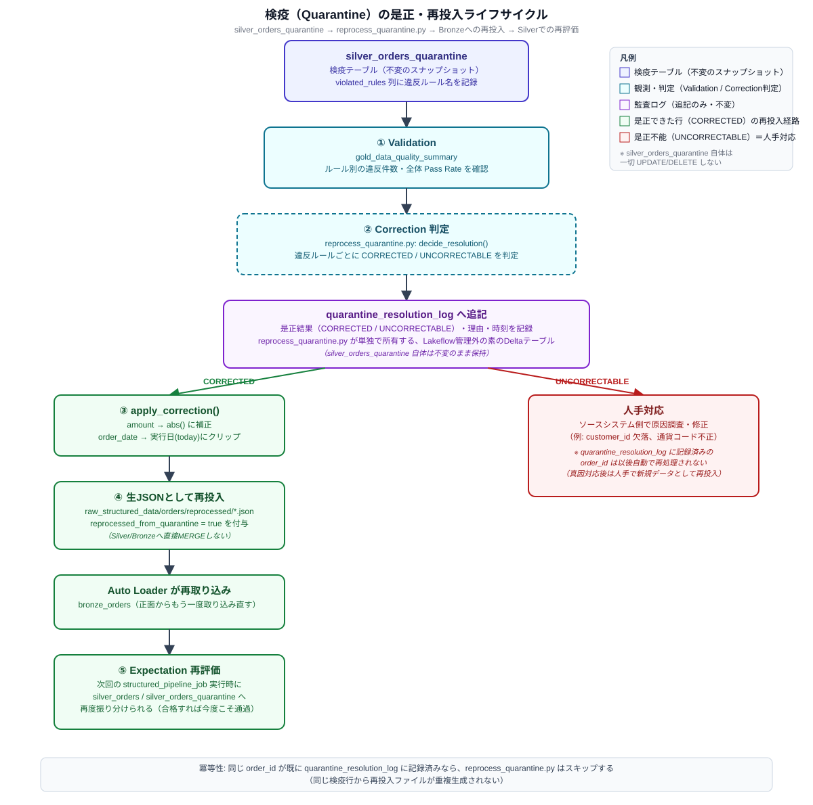

# dab_data_platform

Databricks Free Edition（workspace: `dbc-a2d384f2-d156`）向けに構築した、Databricks Asset
Bundle（DAB）です。同一バンドル内に2つの独立した Lakeflow パイプラインを定義しています。

1. **[第1部: RAGパイプライン](#第1部-ragパイプライン非構造化ドキュメント)**（`rag_pipeline_etl`）:
   非構造化ドキュメント向けメダリオン基盤。Lakeflow Declarative Pipelines による
   Bronze/Silver/Gold ETL、Unity Catalog ABAC による行レベルアクセス制御、
   Vector Search index の同期までを実装。
2. **[第2部: 構造化データパイプライン](#第2部-構造化データパイプラインcustomersorders)**
   （`structured_pipeline_etl`）: customers/orders のような構造化データ向けメダリオン基盤。
   Lakeflow SDP（Spark Declarative Pipelines）による Bronze/Silver/Gold、
   AUTO CDC（SCD Type 2）、**検疫（Quarantine）による品質ゲート**、Row Filter /
   Column Mask を実装。

2つのパイプラインで共通するセットアップ・運用の話は
[「共通事項」](#共通事項)にまとめ、パイプライン固有の話はそれぞれの章に分けています。

---

# 共通事項

## 全体構成（フォルダツリー）

RAGパイプラインと構造化データパイプラインは同じバンドル・同じディレクトリ規約
（`resources/` にDAB定義、`src/<pipeline>/` に実装、`governance/` にガバナンスSQL、
`sample_data/` にサンプルデータ、`tests/unit` に純粋関数テスト）を共有しています。

```
dab_data_platform/
├── .github/workflows/                          # GitHub Actions（CI: test+validate, CD: bundle deploy）※両パイプライン共通
├── databricks.yml                              # DAB定義（RAG・構造化データ共通の1つのバンドル）
├── pyproject.toml                              # 依存関係（pyspark, databricks-sdk, pytest 等）※共通
├── docs/images/                                # README用の図版（SVG）
│
├── resources/
│   ├── rag_unity_catalog.yml                   # [RAG] スキーマ/Volumeの宣言的作成（既存カタログ配下）
│   ├── rag_pipeline_etl.pipeline.yml           # [RAG] Lakeflow SDP（bronze/silver/gold）
│   ├── rag_pipeline_job.job.yml                # [RAG] seed_sample_data -> ETL のスケジュール実行
│   ├── rag_vector_search.yml                   # [RAG] vector_search_endpoints + indexes
│   ├── rag_abac_policies_job.job.yml           # [RAG] governance/abac_policies.sql を適用する Job
│   ├── structured_unity_catalog.yml            # [構造化データ] スキーマ/Volume
│   ├── structured_pipeline_etl.pipeline.yml    # [構造化データ] Lakeflow SDP本体
│   ├── structured_pipeline_job.job.yml         # [構造化データ] seed → ETL のスケジュール実行
│   ├── structured_quarantine_reprocessing_job.job.yml  # [構造化データ] 検疫是正ジョブ
│   └── structured_governance_job.job.yml       # [構造化データ] governance/structured_governance.sql 適用ジョブ
│
├── src/
│   ├── rag_pipeline_etl/                       # [RAG]
│   │   ├── common/                             # pyspark非依存の純粋関数（テスト容易性のため分離）
│   │   ├── seed/seed_sample_data.py            # サンプルデータをUC Volumeへ登録するスクリプト
│   │   ├── explorations/sample_exploration.ipynb
│   │   └── transformations/
│   │       ├── bronze/bronze_documents.py
│   │       ├── silver/silver_parsed_documents.py
│   │       └── gold/
│   │           ├── stg_chunks_ai_prep_search.py       # 手法A（中間ビュー）
│   │           ├── stg_chunks_fixed_overlap.py        # 手法B（中間ビュー）
│   │           ├── gold_document_chunks_for_search.py # UNION統合。ABAC判定属性列込み
│   │           └── gold_chunk_metrics_views.py        # Genie Space用の集計ビュー
│   │
│   └── structured_pipeline_etl/                # [構造化データ]
│       ├── structured_common/                   # pyspark非依存の純粋関数（テスト容易性のため分離）
│       │   ├── quality_rules.py                 # ★検疫パターンの要。ORDER_RULES/CUSTOMER_RULES等
│       │   ├── pii.py                           # 匿名化・仮名化の参照実装（hash/mask/generalize）
│       │   └── reprocessing_rules.py            # 是正可否の判定ロジック（CORRECTED/UNCORRECTABLE）
│       ├── seed/seed_structured_sample_data.py
│       ├── reprocessing/reprocess_quarantine.py  # 検疫の是正・再投入ジョブ
│       └── transformations/
│           ├── bronze/
│           │   ├── bronze_customers.py
│           │   └── bronze_orders.py             # カード番号を即時ハッシュ化し生値を一切保持しない
│           ├── silver/
│           │   ├── silver_customers.py          # AUTO CDC (SCD Type 2) + PII匿名化
│           │   ├── silver_orders.py             # 正常系（Drop）
│           │   └── silver_orders_quarantine.py  # ★検疫系（ORDER_RULESの否定を捕捉）
│           └── gold/
│               ├── gold_daily_sales_by_region.py  # MV。Row Filter対象
│               ├── gold_customer_summary.py       # MV。Row Filter + Column Mask対象
│               ├── gold_order_quality_gate.py     # MV。Fail（重複キー等の重大ゲート）
│               └── gold_data_quality_summary.py   # MV。検疫状況の観測用サマリ
│
├── governance/
│   ├── abac_policies.sql                       # [RAG] governed tags + CREATE POLICY（ABAC行フィルタ）
│   └── structured_governance.sql               # [構造化データ] Owner設定 + 記述タグ + Row Filter + Column Mask
│
├── sample_data/
│   ├── documents/                              # [RAG] department/classification別サンプルドキュメント
│   └── structured/                             # [構造化データ] customers/orders サンプル
│
└── tests/
    ├── unit/                                    # pyspark非依存。RAG・構造化データ両方の純粋関数をテスト ※共通
    └── integration/                             # [RAG] 実ワークスペースに対するE2Eテスト（既定でスキップ）
```

## Databricks CLI のインストール・認証設定

両パイプラインで共通の前提です。

1. Databricks CLI をインストールする（Mac）。

   Homebrew を使う方法（推奨）。
   ```
   brew tap databricks/tap
   brew install databricks
   ```

   Homebrew を使わない場合は公式インストールスクリプトでも可。
   ```
   curl -fsSL https://raw.githubusercontent.com/databricks/setup-cli/main/install.sh | sh
   ```

   インストール後、バージョンを確認する（0.230系以降を推奨。DAB / Lakeflow / Vector Search
   関連の新しいリソース定義を扱うため、古いバージョンだと構文が認識されないことがある）。
   ```
   databricks -v
   ```

   既に古いバージョンが入っている場合は Homebrew ならアップグレードする。
   ```
   brew upgrade databricks
   ```

2. Free Edition ワークスペースにプロファイルを設定する。**OAuthブラウザログイン（推奨）**を使う。
   ```
   databricks auth login --host https://dbc-a2d384f2-d156.cloud.databricks.com
   ```
   ブラウザが自動で開くので、Databricksアカウントでログイン・許可するとターミナル側で
   認証完了する。手動でトークンを発行・コピー・管理する必要がなく、有効期限が切れても
   再度同じコマンドを実行するだけでよい。プロファイル名はデフォルトでログインした
   アカウントのメールアドレスになる（例: `you@example.com`）。

   設定内容は `~/.databrickscfg` に保存される。認証状態は以下で確認できる。
   ```
   databricks auth describe
   databricks current-user me
   ```

   > **同じhostに複数プロファイルがあり `multiple profiles matched` エラーになる場合**
   > （例えば以前 `databricks configure` を試して host だけの `[DEFAULT]` が残っている等）、
   > `databricks.yml` 側は特定のプロファイル名を固定していない
   > （CI/CDがサービスプリンシパルの環境変数認証を使うため、bundle設定にローカルの
   > プロファイル名を書き込まない方針にしている）。実行時に以下のどちらかで解決すること。
   > ```
   > databricks bundle deploy -t dev --profile <使いたいプロファイル名>
   > # または
   > export DATABRICKS_CONFIG_PROFILE=<使いたいプロファイル名>
   > ```
   > 恒久的に1つに絞りたい場合は `~/.databrickscfg` を編集し、不要なプロファイルの
   > セクションを削除するか `databricks auth login --host <host> --profile <名前>` で
   > 上書きしてもよい。

   **代替: Personal Access Token（PAT）方式**
   `databricks configure --host <host>` を実行すると `Personal access token:` の入力を
   求められる。この場合はワークスペースUI（右上のユーザーアイコン → Settings →
   Developer タブ → Access tokens → Generate new token）で発行したトークン文字列を
   貼り付ける。トークンは発行時にしか表示されないため、その場でコピーしておくこと。
   PATには有効期限があり、失効すると再発行・差し替えが必要になるため、
   通常は上記のOAuthログインを推奨する。

## SQL ウェアハウス ID の設定

RAGパイプラインの `rag_abac_policies_job`、構造化データパイプラインの
`structured_governance_job` の両方が SQL ウェアハウスを使用します。

**IDの確認方法**
```
databricks warehouses list
```
もしくはUIで 左サイドバー「SQL」→「SQL Warehouses」→ 対象のウェアハウスをクリックし、
URL末尾（`.../sql/warehouses/<ID>`）または「Connection details」タブの HTTP Path
（`/sql/1.0/warehouses/<ID>`）から確認する。Free Edition では既定で
`Serverless Starter Warehouse` が1つ用意されている。

**設定方法（`databricks.yml` を書き換えない）**
`variables.warehouse_id` は `default: ""` のままにしてあり、各自の環境で
Databricks Asset Bundles の公式な変数上書き機構である
**環境変数 `BUNDLE_VAR_<変数名>`** を使って値を注入する運用にしている
（ワークスペースごとに異なる値をリポジトリにコミットしないため）。
```
export BUNDLE_VAR_warehouse_id=<確認したウェアハウスID>
```
`~/.zshrc` 等に追記して恒久化してもよいし、単発なら
`databricks bundle deploy -t dev --var="warehouse_id=<ID>"` のように
`--var` オプションでも上書きできる（優先順位は `--var` > `BUNDLE_VAR_*` 環境変数 >
`targets.<target>.variables` > `variables` の `default`）。
GitHub Actions での設定方法は [CI/CD](#cicdgithub-actions) セクションを参照。

## テスト

```
pip install -e ".[dev]"
pytest tests/unit -m "not integration"    # pyspark / Databricks Runtime不要。RAG・構造化データ両方の純粋関数を検証
pytest tests/integration -m integration   # [RAGのみ] 要: デプロイ済みワークスペースへの接続情報
```

`tests/unit` は `pyspark.pipelines`（Lakeflow）に依存しない
`src/rag_pipeline_etl/common/` と `src/structured_pipeline_etl/structured_common/` の
純粋関数のみを検証するため、ローカル環境や通常のCIでもそのまま実行できます
（両ディレクトリは `common` / `structured_common` とパッケージ名が異なるため、
`pyproject.toml` の `pythonpath` に両方追加してもimportの衝突は起きません）。

パイプライン固有のテストだけを実行したい場合は以下のように対象を絞れます。

```
# RAGパイプライン分のみ
pytest tests/unit/test_silver_parsed_documents.py tests/unit/test_gold_chunking_union.py -v

# 構造化データパイプライン分のみ
pytest tests/unit/test_structured_quality_rules.py tests/unit/test_structured_pii.py \
       tests/unit/test_structured_reprocessing_rules.py -v
```

## CI/CD（GitHub Actions）

リポジトリ: https://github.com/junTaniguchi/dab_data_platform

`.github/workflows/ci.yml` と `.github/workflows/cd.yml` を用意しています。バンドル全体
（RAG・構造化データ両パイプライン）を対象にしており、パイプライン単位で分かれてはいません。
実際に動かすには GitHub 側で以下の設定が必要です。

### 1. 認証情報（Secrets）

Databricks への認証は、個人アクセストークンではなく **サービスプリンシパルの OAuth
（M2M / client credentials）** を使うことを推奨します（CI/CDでの利用がDatabricksの推奨方式で、
個人トークンのように退職・ローテーションで壊れないため）。

Databricksワークスペースでサービスプリンシパルを作成し、対象の catalog/schema/volume/warehouse
に必要な権限（`USE CATALOG`, `USE SCHEMA`, `CREATE TABLE`, `READ VOLUME`/`WRITE VOLUME`,
SQLウェアハウスの `CAN_USE`、構造化データパイプラインを使う場合は Secret Scope の `READ` 等）を
付与した上で、GitHubリポジトリの **Settings > Secrets and variables > Actions** に以下を
登録してください。

| Secret name                 | 内容                                                             |
|------------------------------|------------------------------------------------------------------|
| `DATABRICKS_HOST`            | `https://dbc-a2d384f2-d156.cloud.databricks.com`                  |
| `DATABRICKS_CLIENT_ID`       | サービスプリンシパルのクライアントID                              |
| `DATABRICKS_CLIENT_SECRET`   | サービスプリンシパルのシークレット                                |

`warehouse_id` はワークスペース固有の値ではあるが機密情報ではないため、Secret ではなく
**Settings > Secrets and variables > Actions > Variables** タブに **repository variable**
として登録し、ワークフロー内で `BUNDLE_VAR_warehouse_id` 環境変数として渡す
（`databricks.yml` 側は書き換えない。詳細は [SQLウェアハウスIDの設定](#sql-ウェアハウス-id-の設定) 参照）。

| Variable name            | 内容                                              |
|----------------------------|---------------------------------------------------|
| `DATABRICKS_WAREHOUSE_ID`   | `databricks warehouses list` で確認したウェアハウスID |

### 2. GitHub Environments（承認フロー・ブランチ保護）

- リポジトリの **Settings > Environments** に `dev` と `prod` の2つの Environment を作成する。
- `prod` には Required reviewers（レビュー承認）を設定し、本番デプロイ前に人の承認を挟む。
- `main` ブランチには Branch protection rule を設定し、`CI` ワークフロー（`unit-test` /
  `bundle-validate`）の成功をマージ必須条件にする。

### 3. ワークフローの役割

- **`ci.yml`**（PR作成時・main push時に実行）
  - `pytest tests/unit -m "not integration"` — pyspark非依存の純粋関数テストを実行（RAG・構造化データ両方）
  - `databricks bundle validate -t dev` — バンドル定義の構文・変数解決チェック（バンドル全体）
- **`cd.yml`**（main への push、または手動実行 `workflow_dispatch`）
  - `databricks bundle deploy -t <dev|prod>` — バンドルをデプロイ
  - `databricks bundle run rag_abac_policies_job -t <dev|prod>` — RAGのABACポリシーを適用
  - 通常の push は `dev` に、`workflow_dispatch` で `target: prod` を選んだ場合のみ `prod`
    environment（レビュー承認）を経由してデプロイする構成にしてある。

### 4. 未実装・要検討事項

- `rag_pipeline_job` / `structured_pipeline_job`（ETL本体）は cd.yml では自動実行していません。
  スケジュール実行（各 `*.job.yml` の cron）に任せるか、cd.yml に
  `databricks bundle run <job名>` のステップを追加するかは運用方針次第です。
- `structured_governance_job`（Row Filter/Column Mask/Owner/Tag適用）も同様にcd.ymlでは
  自動実行していません。
- 統合テスト（`tests/integration`、RAGのみ）をCIに組み込む場合は、`RAG_DAB_*` 環境変数を
  ワークフロー内で secrets から設定し、実際にデプロイ済みのdev環境に対して実行するジョブを
  別途追加してください。
- Databricks CLI のインストールに使っている `databricks/setup-cli@main` は公式Actionです。
  ピン留めしたい場合はタグ付きバージョンに固定してください。

## Lakeflow実装で共通して踏まえた技術的注意点

以下は最初に RAGパイプラインを実装した際に実機で判明し、後から作った構造化データ
パイプラインにも同様に適用している、Lakeflow Declarative Pipelines 全般の制約です。

- **`__file__` は使えない**: Lakeflow の変換ファイルは分離モジュールとして exec されるため
  `__file__` が未定義。`spark.conf.get("<pipeline>_src_root")`
  （各 `*.pipeline.yml` の `configuration` 経由）で代替している。同じ理由で
  `seed_sample_data.py` / `seed_structured_sample_data.py` / `reprocess_quarantine.py` も
  `--sample_data_dir` / `--src_root` 等の引数でパスを明示的に受け取る設計にしてある。
- **デコレータ引数は関数内で遅延解決できない**: `@dp.expect_all_or_drop(RULES)` のような
  デコレータの引数は、モジュールロード時点（decorator評価時点）で束縛済みでなければならない。
  そのため `structured_common` への `sys.path` 追加・import を関数の中まで遅延できないケースがある
  （`silver_orders.py` / `gold_order_quality_gate.py`）。関数本体の中でしか使わない場合
  （`silver_orders_quarantine.py`）は、`bronze_documents.py` と同じ「関数内で
  `spark.conf.get(...)` する」安全なパターンに寄せてある。
- **`input_file_name()` は Unity Catalog非対応**: `bronze_documents.py` / 構造化データの
  Bronze変換では `_metadata.file_path` を使う（`binaryFile` フォーマットの場合は `path` 列）。
- **spark_python_task の `environment_version`**: 旧 `client: "1"` は
  `Invalid platform channel Client-1` でクラスタ起動に失敗するため `environment_version: "2"`
  を明示する。
- **dev target の自動プレフィックス**: `mode: development` により、実際に作成される
  スキーマ名には `dev_<user>_` が自動付与される（例: `rag_dev` → `dev_ultia0602_rag_dev`）。
  `${var.schema}` のプレーンな値を使うと存在しないスキーマ名を参照してしまうため、
  Volumeパスやジョブのパラメータでは必ず `${resources.schemas.<schema資源名>.name}`
  （リソース参照）を使うようにしてある。
- **カタログは新規作成しない**: Free Edition では `CREATE CATALOG` に明示的な
  storage location が必要（"Metastore storage root URL does not exist... provide a
  storage location"、UIからの作成でのみ Default Storage が自動適用される）。そのため
  新規カタログは作らず、既定で存在する管理カタログ `workspace`
  （`variables.catalog` の default）の配下にスキーマ・Volumeだけを作成する構成にしている。
  別のワークスペース/カタログを使う場合は `variables.catalog` の default を変更すること。
- **Auto Loader の再帰探索**: サブディレクトリ配下にもファイルが置かれうる場合は
  `.option("recursiveFileLookup", "true")` を明示する（既定で再帰されるとは限らない）。
  構造化データパイプラインの `bronze_orders.py` は、検疫の再処理ジョブが
  `orders/reprocessed/` サブフォルダへ再投入ファイルを書くため、これを明示している。

---

# 第1部: RAGパイプライン（非構造化ドキュメント）

## サンプルデータ

`sample_data/documents/<department>/<classification>/*.txt` に、部署・機密レベルが異なる
6件のサンプル文書を用意しています（架空の企業 "Acme Analytics" の想定）。

| department  | classification | file                          |
|-------------|-----------------|--------------------------------|
| hr          | confidential     | disciplinary_process.txt      |
| hr          | internal          | onboarding_guide.txt           |
| finance     | restricted        | q3_forecast_internal.txt       |
| finance     | internal          | expense_policy.txt             |
| engineering | internal          | architecture_overview.txt      |
| general     | public            | company_faq.txt                 |

`department` / `classification` はファイルパスから抽出され、Bronze -> Silver -> Gold まで
そのまま引き継がれ、`governance/abac_policies.sql` の ABAC 行フィルタが参照する判定属性列
として使われます。

## セットアップ手順

[「共通事項」](#共通事項)（Databricks CLI・OAuthログイン・warehouse_id）が完了している
前提で、以下のRAG固有のステップを行います。

1. `governance/abac_policies.sql` 内の `security-admins` / `dept-hr` 等のアカウントグループを
   事前に作成しておく（存在しない場合、ABACポリシーの `IS_ACCOUNT_GROUP_MEMBER` は単に false 扱い
   になり誰も一致しない。未作成のままでもデプロイ自体は失敗しない）。

2. バンドルをデプロイする。**初回はここで `vector_search_indexes` の作成だけ失敗する**
   （Gold テーブルがまだ存在しないため。想定通りの動作なので無視してよい）。
   ```
   databricks bundle deploy -t dev
   ```
   ```
   Error: cannot create resources.vector_search_indexes.rag_document_chunks_index:
   Table 'workspace.<schema>.gold_document_chunks_for_search' does not exist.
   ```

3. サンプルデータ投入 + ETL実行（Bronze → Silver → Gold テーブルを実際に作成する）。
   ```
   databricks bundle run rag_pipeline_job -t dev
   ```
   数分かかる（サーバーレスクラスタの起動込み）。完了後、もう一度デプロイすると
   Gold テーブルが存在するようになるため Vector Search index の作成に進める。
   ```
   databricks bundle deploy -t dev
   ```
   `databricks vector-search-indexes get-index workspace.<schema>.rag_document_chunks_index`
   で `"ready": true` になっていることを確認する（初回同期は数分かかることがある）。

4. ABACポリシーの適用。
   ```
   databricks bundle run rag_abac_policies_job -t dev
   ```
   2回目以降にこのジョブを再実行する場合は、`governance/abac_policies.sql` 冒頭の
   `CREATE GOVERNED TAG` 文をコメントアウトすること（後述の「既知の制約」セクション参照）。

5. Vector Search index の同期状況を Databricks UI（Catalog Explorer > 該当スキーマ >
   Vector Search）、またはCLIの `databricks vector-search-indexes get-index <index名>` で確認する。

`rag_pipeline_job` の schedule は事故防止のため `pause_status: PAUSED` にしてあります。
動作確認後、`resources/rag_pipeline_job.job.yml` を `UNPAUSED` に変更して再デプロイしてください。

## Vector Search Index（Delta Sync Index）に登録されたデータを閲覧する

Delta Sync Index はテーブルではなく検索専用のインデックスなので、`SELECT * FROM <index名>`
のように通常のSQLで中身を一覧することはできません。以下の3つの方法を組み合わせて確認します。

### 1. 同期元テーブルを直接見る（登録されている元テキストを確認する）

Delta Sync Index は `gold_document_chunks_for_search` を同期元（source_table）にしているため、
実際に埋め込みの元になったテキストやメタデータは、同期元テーブルへの通常のSQLで確認できます。
一番手軽で、まず確認すべき方法です。

```sql
SELECT chunk_id, department, classification, chunk_method, chunk_text
FROM <catalog>.<schema>.gold_document_chunks_for_search
ORDER BY ingestion_time DESC
LIMIT 20;
```

### 2. Databricks UI で類似検索を試す

Catalog Explorer > 対象カタログ・スキーマ を開くと `rag_document_chunks_index` が
Vector Search index として表示されます。開くと以下を確認できます。

- 同期ステータス（`Ready` / `Provisioning` / `Failed`）と `source_table` / 埋め込みモデル
  （`databricks-gte-large-en`）等のインデックス定義
- クエリ入力欄から検索文字列を入れて、近傍検索結果（`chunk_text` 等と類似度スコア）を
  UI上でそのまま確認できる画面（Playground / Query タブ相当。UIバージョンによって名称は
  変わりうる）

### 3. CLI / Python SDK で類似検索クエリを実行する（実際に動作確認済み）

**Python SDK（推奨）**: 以下のスクリプトは実際にこのワークスペースの
`rag_document_chunks_index` に対して実行し、`"経費精算のルールを教えて"` というクエリに対して
`finance/internal` の経費精算ポリシー文書が上位に返ってくることを確認済みです。

```python
from databricks.sdk import WorkspaceClient

w = WorkspaceClient()  # ローカルのプロファイル/環境変数から認証情報を解決
result = w.vector_search_indexes.query_index(
    index_name="workspace.<schema>.rag_document_chunks_index",
    query_text="経費精算のルールを教えて",
    columns=["chunk_text", "department", "classification"],
    num_results=5,
)
for row in result.result.data_array:
    department, classification, score, chunk_text = row[1], row[2], row[3], row[0]
    print(department, classification, round(score, 3), chunk_text[:60])
```

**Databricks CLI**: 同じ内容を CLI からも呼び出せます（`--json` でリクエストボディ全体を渡す。
`--query-text` 単体フラグは `columns` を指定できないため使えない）。

```
databricks vector-search-indexes query-index workspace.<schema>.rag_document_chunks_index \
  --json '{"query_text": "経費精算のルールを教えて", "columns": ["chunk_text","department","classification"], "num_results": 5}'
```

> **既知のCLIの不具合（Databricks CLI v1.9.0で確認）**: 上記コマンドはサーバー側では
> 正常に `200 OK` で結果を返しているものの、CLI クライアント側のレスポンス整形処理で
> `failed to unmarshal response body: invalid character 'r' after top-level value` という
> エラーを表示することを実機で確認しています（結果自体は取得できており、エラー出力に
> 含まれるHTTPレスポンスのログの中に実際の検索結果がJSONとして表示される）。
> 結果を確実に・読みやすく取得したい場合は上記の Python SDK か UI を使うことを推奨します。

補足: Delta Sync Index自体は埋め込みベクトル（数値配列）も保持していますが、生のベクトル値は
人間が読んでも意味を判断できないため、実運用では「①同期元テーブルで元テキストを確認する」
「③類似検索クエリで実際の検索結果（どの文書が上位に来るか）を確認する」の組み合わせで
動作確認するのが一般的です。

## 既知の制約・手動での対応が必要な部分

このバンドルは Databricks Free Edition のワークスペース（Databricks CLI v1.9.0）に対して
**実際に `bundle deploy` / `bundle run` を最後まで実行し、Bronze→Silver→Gold→Vector Search→
ABAC行フィルタが動作することを確認済み**です。以下は、その過程で判明した実際の制約と、
コード側で対応済みの内容・利用者側で手動対応が必要な内容です（Lakeflow全般に共通する制約は
[共通事項の該当セクション](#lakeflow実装で共通して踏まえた技術的注意点)を参照）。

### コード側で対応済み（設計として理解しておくとよい点）

- **`vector_search_indexes` は実テーブルを要求する**: 中間ビュー（`stg_chunks_*`）や Gold を
  バッチ読み込み（`dp.read`）で作っていると、Lakeflow はテーブルを `MATERIALIZED_VIEW` として
  作成する。Vector Search の delta_sync index は `DESCRIBE HISTORY` が使える実テーブル
  （Change Data Feed対応）を要求するため、`MATERIALIZED_VIEW` だと
  `[EXPECT_TABLE_NOT_VIEW.NO_ALTERNATIVE] ... expects a table but ... is a view` で
  index の同期が失敗する。そのため `stg_chunks_ai_prep_search.py` / `stg_chunks_fixed_overlap.py` /
  `gold_document_chunks_for_search.py` は upstream をすべて `dp.read_stream` にし、
  `gold_document_chunks_for_search` が `STREAMING_TABLE`（実テーブル）になるようにしてある。
  加えて、Vector Search は Change Data Feed も要求する
  （`delta.enableChangeDataFeed = true` を `table_properties` に設定済み）。
- **`vector_search_indexes.endpoint_name` はリソース参照にする**: `${var.xxx}` のような
  ただの変数参照だと、値が同じでもバンドルの依存グラフには乗らず、endpoint 作成前に
  index 作成が走って `AI Search endpoint ... not found (404)` になる。
  `${resources.vector_search_endpoints.rag_vector_search_endpoint.name}` のような
  **リソース参照**にすることで、CLI が正しい順序でデプロイするようにしてある
  （`depends_on` フィールドはこのCLIバージョンでは未サポート）。
- **UDF (`F.udf`) は使わない**: `common/` パッケージを `sys.path.append` して import した
  純粋関数を `F.udf()` でラップして使うと、ドライバでは動いても executor 側で
  `ModuleNotFoundError: No module named 'common.xxx'` になる（UDFのクロージャは
  cloudpickle で別プロセスに転送されるため）。そのため chunk_id 生成・固定長チャンキングは
  `F.sha2` / `sequence`+`substring` のようなネイティブ Spark SQL 式で実装している。
  `common/` の同名関数は参照実装・単体テスト用として残している。

### 利用者側で手動対応が必要な部分

- **`ai_parse_document` の戻り値**: `ai_parse_document(content)` は VARIANT を返し、
  `document.pages` はそのVARIANT内のARRAYなので `variant_get(expr, path, 'ARRAY<VARIANT>')`
  でキャストしてから `transform` する必要がある（`:` パス記法のままだと
  `[DATATYPE_MISMATCH.UNEXPECTED_INPUT_TYPE]` になる）。またサンプルデータの `.txt` は
  `ai_parse_document` 非対応で `"error_status":[{"error_message":"Unsupported file format:
  unknown"}]` を返す（PDF/画像等でのみ意味のある結果が得られる）。実データで
  `src/rag_pipeline_etl/explorations/sample_exploration.ipynb` を使って構造を確認し、
  `silver_parsed_documents.py` の `PARSED_TEXT_EXPR` を必要に応じて調整すること。
- **`ai_prep_search` は生テキストではなくパース済みVARIANTを期待する**: 実際に確認した
  ところ、`ai_prep_search(<プレーン文字列>)` はエラーVARIANT
  （`{"error_message":"The input content is invalid.","response":null}`）を返す。
  `stg_chunks_ai_prep_search.py` は `silver_parsed_documents.parsed_text`（文字列）を
  そのまま渡す実装のため、非対応フォーマットのサンプルデータでは常にチャンク0件になる
  （型エラーにはならず安全に空配列になることは確認済み）。実運用でPDF等を使う場合は、
  Silver側で `ai_parse_document` の結果（VARIANT）もそのまま保持してGold側に渡す設計に
  変更したほうがよい可能性がある。
- **Unity Catalog ABAC（`CREATE POLICY` / `CREATE GOVERNED TAG`）**: 実際に動作を確認した
  正しい構文は当初の想定とかなり異なっていた。要点:
  - governed tag のキー（`abac_dimension`）は**account レベルで事前登録が必要**
    （`CREATE GOVERNED TAG <key> VALUES (...)`。UIからも作成可）。未登録のまま
    `ALTER TABLE ... SET TAGS` すると `Unknown tag policy key` になる。
  - `CREATE GOVERNED TAG` に `IF NOT EXISTS` は無く、既に存在すると
    `ALREADY_EXISTS: Tag policy already exists` でジョブ全体が失敗するため、
    **2回目以降の実行前に `governance/abac_policies.sql` 冒頭の
    `CREATE GOVERNED TAG` 行をコメントアウトすること**。
  - 1テーブルに ROW FILTER ポリシーは1つしかアタッチできない
    （`UC_ABAC_MULTIPLE_ROW_FILTERS`）。classification / department の判定は
    1つのUDF・1つのPOLICYにまとめてある。
  - `CREATE POLICY ... ON SCHEMA <securable>` の `<securable>` 部分は `IDENTIFIER()`
    非対応（`ALTER TABLE` 等とは異なる）。dev target のスキーマ名は動的
    （`dev_<user>_...` プレフィックス）なので `EXECUTE IMMEDIATE` で動的SQLとして
    実行している。埋め込む単一引用符は `''` ではなく `CHR(39)` を使うこと
    （`''` はこの用途で正しく機能しないことを確認済み）。
  - `security-admins` / `dept-hr` 等のアカウントグループが未作成の場合、
    `IS_ACCOUNT_GROUP_MEMBER` は単に `false` を返すだけで、ジョブ自体は失敗しない
    （＝管理者以外閲覧不可、というfail-closed側に倒れる）。
- **Vector Search リソース宣言**: `resources.vector_search_endpoints` /
  `resources.vector_search_indexes` は Free Edition でも実際に動作することを確認済み
  （STANDARD endpoint、HYBRID index_subtype）。ただし初回の index 作成・同期には
  数分〜十数分程度かかることがある（`ready: false` の間は
  `"Delta sync index creation is pending endpoint provisioning."` 等のメッセージになる）。
- **`query-index` CLIの表示バグ**: 上記「Vector Search Indexに登録されたデータを閲覧する」
  セクション参照。CLI v1.9.0ではレスポンス整形時にクライアント側でエラー表示になる
  （検索自体はサーバー側で成功している）。Python SDK か UI を使えば問題なく結果を確認できる。
- サンプルデータは `.txt` のプレーンテキストです。実際の非テキスト文書（PDF等）での
  動作確認は別途 Volume に配置して行ってください
  （`bronze_documents.py` / `silver_parsed_documents.py` は拡張子で分岐する実装）。

---

# 第2部: 構造化データパイプライン（customers/orders）

customers（顧客マスタ・CDC）/ orders（受注ファクト）を題材にした、構造化データ向けの
Lakeflow SDP（Spark Declarative Pipelines）実装です。

## 概要・アーキテクチャ

```
raw_structured_data (UC Volume)
├── customers/*.csv  ──▶ bronze_customers ──▶ silver_customers_cleaned(view)
│                                                     │  (Drop: CUSTOMER_RULES)
│                                                     ▼
│                                          AUTO CDC (SCD Type 2)
│                                                     ▼
│                                            silver_customers ──▶ gold_customer_summary (MV)
│
└── orders/*.json    ──▶ bronze_orders ──┬─▶ silver_orders             (Drop: ORDER_RULES, 正常系)
                                          │        │
                                          │        ├─▶ gold_daily_sales_by_region (MV)
                                          │        └─▶ gold_order_quality_gate    (MV, Fail)
                                          │
                                          └─▶ silver_orders_quarantine  (ORDER_RULESの否定, 検疫系)
                                                   │
                                                   ▼
                                          gold_data_quality_summary (MV)

reprocessing/reprocess_quarantine.py（Lakeflowの外側で動く別ジョブ）:
  silver_orders_quarantine を読む
    → 是正可能なら補正して bronze_orders の取り込みVolumeへ"生JSON"として再投入
    → 是正結果は quarantine_resolution_log（Lakeflow管理外の素のDeltaテーブル）へ記録
```

Bronze/Silver/Gold それぞれの設計判断は、添付いただいたリファレンス表（Compute /
schemaLocation / Deletion Vectors / Expectation Action / 匿名化 / Row Filter・Column
Mask / Tag / Predictive Optimization）に沿って実装しています。対応関係は本セクション末尾の
[表](#レイヤー別設定一覧添付リファレンス表との対応)にまとめています。

## サンプルデータ

**customers_seed.csv**（`customer_id, name, email, phone, address, birth_date, region,
status, operation, updated_at, source_system`）: CUST001 は INSERT → UPDATE（Osaka
へ転居、`updated_at` が最新）→ UPDATE（Tokyo のまま、`updated_at` は2番目に古い＝**わざと
順序を入れ替えた「遅延到着（Late Arrival）」イベント**）の3件を持ちます。AUTO CDC の
`sequence_by=updated_at` により、ファイル内の記載順に関わらず正しく最新（Osaka）が
採用されることを確認できます。CUST002 は INSERT → DELETE（解約）で `apply_as_deletes`
を実演します。CUST003 は不正なメール形式を持ち、`CUSTOMER_RULES` の
`valid_email_format` に違反して Drop されます（検疫を用意していないため、この顧客は
Silver 以降から跡形もなく消えます。これは意図的な悪い例です。理由は
`silver_customers.py` のコメントを参照）。

**orders_seed.json**（JSON Lines）: 10件のうち3件が `ORDER_RULES` のいずれかに意図的に
違反しています。

| order_id | 違反ルール | 説明 |
|----------|-----------|------|
| ORD1003  | `positive_amount` | `amount = -500.0`（金額が負） |
| ORD1004  | `customer_id_not_null` | `customer_id = null` |
| ORD1005  | `order_date_not_future` | `order_date = "2099-01-01"`（未来日） |

残り7件（ORD1001, 1002, 1006〜1010）は正常に `silver_orders` へ入ります。ORD1007 は
`status = "DRAFT"` で、Gold の Row Filter（承認前取引の非表示）の実演に使います。

## セットアップ手順

[「共通事項」](#共通事項)（Databricks CLI・OAuthログイン・warehouse_id）が完了している
前提で、以下を行います。

### 1. Secretsの事前準備（PIIハッシュ化ソルト）

カード番号・メールアドレスのハッシュ化に使うソルトは、**バンドル変数やコードに直接
書きません**。事前に Secret Scope を作成し、値を投入してください。

```
databricks secrets create-scope structured_pii
databricks secrets put-secret structured_pii hash_salt --string-value "$(openssl rand -hex 32)"
```

Scope/Key名を変更したい場合は `databricks.yml` の
`variables.pii_hash_salt_secret_scope` / `pii_hash_salt_secret_key` を変更してください
（値そのものではなく、値を保持する場所の"名前"だけをバンドルで管理する設計です）。

サービスプリンシパルでCI/CDから実行する場合は、そのサービスプリンシパルに対象
Secret Scopeの `READ` 権限を付与しておく必要があります。

### 2. ガバナンス用アカウントグループの作成（任意）

`governance/structured_governance.sql` が参照するグループです。未作成でも
SQL自体は失敗しません（`IS_ACCOUNT_GROUP_MEMBER` が単に `false` を返すだけの
fail-closedになります）。

- `security-admins`（既存グループを流用可）
- `region-tokyo` / `region-osaka` / `region-nagoya` / `region-fukuoka` / `region-sapporo`
- `sales-approvers`
- `customer-retention-team`
- `pricing-team`
- `data-engineering`（既存グループを流用可）

### 3. デプロイ・実行

```
databricks bundle deploy -t dev
databricks bundle run structured_pipeline_job -t dev
```

デプロイ後、ガバナンス定義（Owner・タグ・Row Filter・Column Mask）を適用するには以下を実行する。

```
databricks bundle run structured_governance_job -t dev
```

`structured_pipeline_job` / `structured_quarantine_reprocessing_job` の schedule は
事故防止のため `pause_status: PAUSED` にしてあります。動作確認後、必要に応じて
`UNPAUSED` に変更してください。

## 検疫（Quarantine）の実装方式

**これが本パイプラインの中核です。** Databricks / Lakeflow には「検疫」という名前の
組み込み機能はありません。`@dp.expect_or_drop` のような Expectations は、違反した行を
pipeline の出力から除外する（Drop）か、更新自体を失敗させる（Fail）ことはできますが、
**除外された行そのものを後から SELECT できる場所を提供しません**。イベントログ
（`event_log()` や `system.lakeflow.*` System Tables）に残るのは「どのルールが」
「何件」違反したかという**集計値**だけで、「どの行が」「どの値で」違反したかは
どこにも残りません。

つまり「検疫」は Lakeflow の設定でONにする機能ではなく、**自分で組み立てるアーキテク
チャパターン**です。本実装では次の構成で実現しています。

```
bronze_orders（Auto Loaderで取り込んだ生イベント、streaming）
     │
     ├─→ silver_orders            : ORDER_RULES を満たす行だけを残す（正常系）
     │                              @dp.expect_all_or_drop(ORDER_RULES)
     │
     └─→ silver_orders_quarantine : ORDER_RULES のいずれかに違反した行を明示的に捕捉
                                    （検疫系。違反ルール名を violated_rules 列に記録）
```

2つの flow は同じ `bronze_orders` を**独立した streaming read** として消費します
（Lakeflow は同一テーブルへの複数 flow によるファンアウトをサポートしています）。
両方が `structured_common/quality_rules.py` の **同じ `ORDER_RULES` 辞書**を参照して
いるため、

```
silver_orders の行数 + silver_orders_quarantine の行数 == bronze_orders の行数
```

が常に成り立ちます（`tests/unit/test_structured_quality_rules.py` の
`test_valid_and_quarantine_sets_partition_all_sample_orders_without_loss` で
サンプルデータに対してこの性質を固定しています）。ルールを追加・変更する際は
`quality_rules.py` の辞書だけを編集すればよく、正常系・検疫系のロジックが
乖離する心配がありません。

### レイヤーごとの Expectation Action の使い分け

| レイヤー | Action | 意味 | 実装 |
|---------|--------|------|------|
| Bronze  | Warn   | 観測のみ。壊れていても再処理可能性を優先して保持する | `bronze_customers.py` / `bronze_orders.py` の `@dp.expect(...)` |
| Silver  | Drop（＋検疫） | 個々の行の品質問題。除外はするが「消さず隔離する」 | `silver_orders.py`（正常系）+ `silver_orders_quarantine.py`（検疫系） |
| Gold    | Fail   | 集計・重大な不変条件の違反。個別行の問題ではなく上流契約そのものの破綻とみなし、パイプライン更新自体を止める | `gold_order_quality_gate.py` の `@dp.expect_all_or_fail(...)` |

### 是正・再投入ライフサイクル

検疫テーブルの行は「捕捉して終わり」ではありません。以下のサイクルを
`reprocessing/reprocess_quarantine.py` が回します。



1. **Quarantine**: `silver_orders_quarantine` へ捕捉される（パイプライン内で自動）。
2. **Validation**: `gold_data_quality_summary` でルール別の違反件数・Pass Rateを確認する。
3. **Correction 判定**: `structured_common/reprocessing_rules.py` の
   `decide_resolution()` が、既知のルール違反（`positive_amount` /
   `order_date_not_future`）なら `CORRECTED`、原因不明・機械的に補正不能な違反
   （`customer_id_not_null` / `valid_currency`）なら `UNCORRECTABLE` と判定します。
   1行の中に1つでも `UNCORRECTABLE` な違反があれば、他が補正可能でも全体を
   `UNCORRECTABLE` として扱います（中途半端な補正はしない設計）。
4. **監査ログへの追記**: 判定結果（`CORRECTED`/`UNCORRECTABLE`、理由、時刻）を
   `quarantine_resolution_log`（`reprocess_quarantine.py` が単独で所有する、
   Lakeflow管理外の素のDeltaテーブル）へ追記します。**`silver_orders_quarantine`
   自体は一切 UPDATE/DELETE しません**（検疫時点のスナップショットを監査証跡として
   不変のまま保持するため）。この追記は `CORRECTED` / `UNCORRECTABLE` どちらの
   行に対しても行われます。
5. **Reprocessing（`CORRECTED` 行のみ）**: `apply_correction()` で値を補正した上で、
   Bronzeの取り込みVolume（`raw_structured_data/orders/reprocessed/`）へ**生の
   JSONファイルとして再投入**します。**Silver/Bronzeの Lakeflow 管理テーブルへ
   外部から直接 MERGE/UPDATE することはしません**（Lakeflowパイプラインが所有する
   テーブルへパイプライン外部から書き込む挙動はサポートが曖昧なため）。次回の
   パイプライン実行で Bronze → Silver の Expectations 検証を"もう一度正面から"
   通すことで、安全に再評価させます。`UNCORRECTABLE` 行はここで終端し、
   人手でソースシステム側の原因調査・修正を行います。
6. **Expectation再評価**: 次回の `structured_pipeline_job` 実行で、再投入された
   レコードが Bronze → Silver へ流れ、正しければ `silver_orders` / `gold_*` へ
   反映されます（違反が残っていれば再び `silver_orders_quarantine` へ入ります）。

**注意（カード番号のような Bronze で破棄済みの項目について）**: `silver_orders_quarantine`
は Bronze より後段のテーブルなので、Bronzeで即座に破棄したフィールド（生の
`payment_card_number`）はそもそも保持していません。再投入時は `payment_card_hash` /
`payment_card_last4`（既にハッシュ化済みの値）をそのまま引き継ぎ、
`bronze_orders.py` はどちらの形（生カード番号 or ハッシュ済み値）でも取り込める
ように coalesce ロジックを持っています。**一般に、Bronzeで不可逆に破棄した情報は
検疫テーブルから復元できないという制約は、どのフィールドを Bronze 段階の
匿名化対象にするかを設計する際に必ず意識してください。**

再処理ジョブ実行後の挙動: 初めて再処理由来のJSON（`payment_card_hash`等の新しい列を
含む）が Auto Loader に読み込まれると、`cloudFiles.schemaEvolutionMode=addNewColumns`
によりスキーマ進化が発生し、ストリームが一度再起動します（`UnknownFieldException` で
一時的にジョブが失敗したように見えますが、Auto Loaderの正常な仕様で自動的に再起動して
継続します）。また `orders/reprocessed/` はサブフォルダのため、`bronze_orders.py` では
`recursiveFileLookup=true` を明示しています。

### 検疫状況の確認方法

```sql
-- ルール別の違反件数・全体Pass Rate
SELECT * FROM <catalog>.<schema>.gold_data_quality_summary;

-- 検疫された行そのものを確認する
SELECT * FROM <catalog>.<schema>.silver_orders_quarantine;

-- 是正結果（quarantine_resolution_log は reprocess_quarantine.py を
-- 一度実行するまでは存在しない）
SELECT * FROM <catalog>.<schema>.quarantine_resolution_log;

-- 検疫 × 是正結果を突き合わせ、未解決の件数を確認する
SELECT
  q.order_id,
  q.violated_rules,
  q.quarantined_at,
  l.resolution_status,
  l.resolved_at
FROM <catalog>.<schema>.silver_orders_quarantine q
LEFT JOIN <catalog>.<schema>.quarantine_resolution_log l
  ON q.order_id = l.order_id
ORDER BY q.quarantined_at DESC;
```

### 再処理ジョブの実行

```
databricks bundle run structured_quarantine_reprocessing_job -t dev
databricks bundle run structured_pipeline_job -t dev   # 再投入分を実際にSilverへ反映する
```

## PIIハンドリング: Silverの匿名化 vs Goldの Row Filter/Column Mask

添付リファレンス表の「匿名化・仮名化」行と「Row Filter/Column Mask」行は、実装方式が
まったく異なる2つの仕組みに対応します。混同しないよう明確に分離しています。

| | Silverの匿名化・仮名化 | GoldのRow Filter/Column Mask |
|---|---|---|
| いつ変換されるか | ETL変換の中で**一度だけ**（書き込み時） | **クエリ実行のたびに**（読み取り時） |
| ストレージ上の値 | 変換後の値（不可逆）で永続化される | 元の値のまま変わらない |
| 実装場所 | `silver_customers.py`（Pythonコード） | `governance/structured_governance.sql`（UC機能） |
| 実装方式 | `sha2` によるハッシュ化／`substring`等による部分マスク・一般化 | `SET ROW FILTER` / `ALTER COLUMN ... SET MASK` |
| 誰が結果を変えるか | 変換ロジック自体が固定（誰が見ても同じ結果） | クエリを実行したユーザーのグループ member ship |

実装した匿名化・仮名化（`silver_customers.py`、いずれも `structured_common/pii.py`
に参照実装あり）:

| 項目 | 手法 | 変換前 → 変換後 |
|------|------|-----------------|
| email | ハッシュ化（Hashing） | `aiko.tanaka@example.com` → `email_hash`（SHA-256、64桁16進文字列） |
| phone | 抑制（Suppression） | `090-1111-2222` → `090-****-2222` |
| birth_date | 一般化（Generalization） | `1988-04-12` → `birth_year = "1988"` |
| address | 一般化（Generalization） | 番地情報は保持せず `address_region` のみ引き継ぐ |

実装した Row Filter / Column Mask（`governance/structured_governance.sql`）:

| 対象テーブル | 種別 | 内容 |
|---|---|---|
| `gold_daily_sales_by_region` | Row Filter | `region-<region>` グループのみ閲覧可（地域別アクセス制御） + `status='DRAFT'` は `sales-approvers` のみ閲覧可（承認前取引の非表示） |
| `gold_customer_summary` | Row Filter | `status='CHURNED'` は `customer-retention-team` のみ閲覧可（解約済み顧客の非表示） |
| `gold_customer_summary.discount_rate` | Column Mask | `pricing-team` 以外には `NULL` を返す（取引先ごとの値引き率の保護） |

「Delta Sharingで取得した列」に対する Row Filter は、本サンプルが自己完結型で外部の
Delta Share を消費していないため実装していません。同じ `SET ROW FILTER` の仕組みが
そのまま適用できます。

RAGパイプライン側（`governance/abac_policies.sql`）は、これとは別の
**governed tag駆動のスキーマレベル ABAC ポリシー**（`CREATE POLICY ... ON SCHEMA`）を
使っています。複数テーブルへ横断的にロジックを適用したい場合はそちらの方式、
1テーブルの特定列・行だけを守りたい場合は本セクションの直接アタッチ方式が
シンプルで壊れにくい、という使い分けです。

## レイヤー別設定一覧（添付リファレンス表との対応）

| 項目 | Bronze | Silver | Gold |
|---|---|---|---|
| Compute | Serverless（`serverless: true`） | 同左 | 同左 |
| schemaLocation | `addNewColumns`（Auto Loader） | Auto Loader不使用のため該当なし（SQL/DataFrameでスキーマ明示） | 同左 |
| データの持ち方 | Append Only | orders=Drop済み正常系／customers=SCD Type 2（AUTO CDC, Late Arrival対応） | 最新集計（MV） |
| Deletion Vectors | 設定なし（追記のみのため不要） | 有効化（`delta.enableDeletionVectors=true`） | Silverで有効化済みのため、GoldのMV（Enzyme増分更新）が自動的にその恩恵を受ける |
| table/view | Streaming Table（`@dp.table`） | Streaming Table | Materialized View（`@dp.materialized_view`） |
| 保持期間 | 30日 | 180日 | 365日 |
| Photon / AQE | Serverless下で自動有効（明示設定不要） | 同左 | 同左 |
| Expectation Action | Warn | Drop（+検疫） | Fail |
| 匿名化対象 | カード番号（即時ハッシュ化・生値は一切保存しない） | email/phone/birth_date/address | Silverで完了済み |
| Owner | schema単位（`data-engineering`） | 同左 | 同左 |
| Row Filter | 不要 | 不要 | region/status（`gold_daily_sales_by_region`）、CHURNED顧客（`gold_customer_summary`） |
| Column Mask | 不要 | 不要 | discount_rate（`gold_customer_summary`） |
| Tag | domain/confidentiality/source_system/business_owner等 | 同左 + pii | 同左 |
| Predictive Optimization | アカウントレベルの既定機能に委ねる（本バンドルではOPTIMIZE/VACUUMジョブを個別定義していない） | 同左 | 同左 |

**添付リファレンス表からの補足・修正点**:

- Predictive Optimization は 2024-11-11 以降に作成されたアカウントで既定有効、既存
  アカウントも順次有効化される account レベルの機能のため、本バンドルでは
  `OPTIMIZE`/`VACUUM` を実行する専用ジョブは定義していません。有効化されていない
  ワークスペースでは、必要に応じて `OPTIMIZE <table>` / `VACUUM <table> RETAIN
  <保持期間に対応する時間> HOURS` を手動またはメンテナンスジョブとして実行してください。
- `dp.create_auto_cdc_flow`（AUTO CDC）は `channel: PREVIEW` を要する比較的新しい
  API です。将来 GA・構文変更の可能性があるため、実際にデプロイして
  `silver_customers` が `__START_AT`/`__END_AT` 付きのSCD2出力になっていることを
  確認してください（列名は Preview機能のため変わる可能性があります）。
- 「schemaLocation: Silver/Gold は許可しない」という記載は、Silver/Gold が
  Auto Loader を使わず Lakeflow の宣言的変換（SQL/DataFrame）でスキーマを明示する
  ため、そもそも Auto Loader のスキーマ推論・進化が介在せず自然に成立します
  （明示的に「禁止」を設定する対象が存在しません）。

## Gold Fail挙動を確認する

デフォルトのサンプルデータには重複 `order_id` を含めていません（初回デプロイで
`gold_order_quality_gate` が意図せず失敗して驚かないようにするため）。意図的に
Gold の Fail 挙動（重複キー検知）を確認したい場合は、以下の手順で重複を注入します。

```
databricks fs cp sample_data/structured/orders_incident/orders_incident_duplicate.json \
  dbfs:/Volumes/<catalog>/<schema>/raw_structured_data/orders/orders_incident_duplicate.json
databricks bundle run structured_pipeline_job -t dev
```

`ORD1002` が重複するため、`gold_order_quality_gate` の
`@dp.expect_all_or_fail(GOLD_ORDER_GATE_RULES)` が `no_duplicate_order_id` 違反を検知し、
パイプライン更新が失敗します。重複ファイルを取り除いてから再実行すると成功に戻ります。

## Expectationで実際に引っかかるサンプルデータ

Bronze層のWarnルール（`BRONZE_ORDER_WARN_RULES` / `BRONZE_CUSTOMER_WARN_RULES`）は、
既定のサンプルデータだけでは一度も違反しない（=Warnが実際に発火するところを
一度も観測できない）状態だった。そのため以下のファイルを追加し、Bronze Warn ルールが
実際に発火するデータを用意した。

- `sample_data/structured/orders/orders_warn_examples.json`
  - `order_id: null` の行 → `order_id_present`（Bronze Warn）が発火
  - `amount: null` の行（`ORD1012`) → `amount_present`（Bronze Warn）が発火
- `sample_data/structured/customers/customers_warn_examples.csv`
  - `customer_id` が空の行 → `customer_id_present`（Bronze Warn）が発火
  - `CUST007`（`@`を含まない不正な形式のメール）→ `email_looks_like_email`（Bronze Warn）が発火

これらは Bronze では Warn（保持されるだけ）だが、Silver の Drop/検疫ルールにも
そのまま違反するため、`silver_customers` からは Drop され、`silver_orders_quarantine`
へ捕捉される（実際にデプロイし、以下の実データで確認済み）。

**この検証作業を通じて、実機で新たなバグを1件発見し修正した**
（詳細は次の「既知の制約」セクションの1件目を参照。`order_id`/`amount` が
`NULL` になり得るケースで、正常系・検疫系のどちらからもサイレントに行が消える
という、検疫パターンの中核的な不変条件を破る不具合だった）。

修正後、`databricks pipelines start-update <pipeline-id> --full-refresh` で
全テーブルを再構築して確認した最終結果:

```
silver_orders_quarantine:
  order_id=NULL   violated_rules=["order_id_not_null"]   -- 新規追加したorder_id_not_nullルールで捕捉
  ORD1003         violated_rules=["positive_amount"]
  ORD1004         violated_rules=["customer_id_not_null"]
  ORD1005         violated_rules=["order_date_not_future"]
  ORD1012         violated_rules=["positive_amount"]      -- amount=NULLがNULL-safe化により正しく捕捉

silver_orders:    9件（＝bronze_orders 14件 − quarantine 5件。過不足なし）
silver_customers: CUST007・customer_id=NULLの行は含まれない（Silverで正しくDrop）
```

## 監視・アラート（構造化データパイプライン）

運用監視として、SQL Alert 11件・ダッシュボード13件・障害調査用SQL 5件を
DABリソース（`resources/structured_monitoring_alerts.yml` /
`resources/structured_monitoring_dashboards.yml`）およびリファレンスSQL
（`monitoring/investigations/*.sql`）として追加し、実際にこのワークスペースへ
デプロイして動作確認した。

### 実在しないテーブル・列の補正について

依頼段階のSQL仕様には、実在しないシステムテーブル・列がいくつか含まれていた
（`system.job_run`、`system.pipelines.events`、`monitoring.table_updates`、
`monitoring.data_quality`、`monitoring.mttr`、`audit_log`、`approved_changes` 等）。
実際にこのワークスペースの `system` スキーマへ `DESCRIBE`/`SHOW TABLES` を実行して
実在するテーブル・列を確認した上で、以下の方針で補正した。

| 依頼時の記述 | 実際には | 補正内容 |
| --- | --- | --- |
| `system.lakeflow.jobs`（result_state列） | 実在しない列 | `system.lakeflow.job_run_timeline` / `job_task_run_timeline` を使用 |
| `system.job_run` | 実在しないテーブル | `system.lakeflow.job_run_timeline` |
| `system.pipelines.events` | 実在しないテーブル | `system.lakeflow.pipeline_update_timeline`（ただしmessage列が無いため、詳細調査には `event_log('<pipeline-id>')` を併用） |
| `system.billing.usage.compute_resource_name` | 実在しない列 | `usage_metadata.warehouse_id` を `system.compute.warehouses`（実在）へJOIN |
| `system.access.audit` でのSELECT/DELETE/UPDATE検知 | UC監査ログはメタデータ操作(createTable等)のみ記録し、行レベルDML(SELECT/DELETE/UPDATE文)は記録しない（実機のaction_name一覧で確認済み） | `system.query.history`（`statement_type`/`statement_text`）を使用 |
| `monitoring.table_updates` | 実在しないテーブル | `system.access.table_lineage`（実在。UCのテーブル間リネージ追跡テーブル）の`event_time`で代用 |
| `monitoring.data_quality` | 実在しないテーブル | 本パイプラインが実際に生成している `gold_data_quality_summary` で代用 |
| `monitoring.mttr` | 実在しないテーブル | `system.lakeflow.job_run_timeline` から「最後のFAILEDから次のSUCCESSまでの時間」を算出して代用 |
| `system.information_schema.tables` | 実在しない（information_schemaは各カタログ配下） | `<catalog>.information_schema.tables` |
| テーブルサイズ(size_gb)の一覧化 | `information_schema.tables` にバイトサイズ列は無い | **未実装**。テーブルごとに`DESCRIBE DETAIL`を個別に叩く別ジョブが必要（本リポジトリの範囲外） |
| `audit_log` ⋈ `approved_changes`（Jira突合） | 実在しない・Jira連携が必要 | **未実装**。No.22ダッシュボードは意図的に用意していない |

### SQL Alert（11件、`resources/structured_monitoring_alerts.yml`）

AlertV2として、`結果1行 × 条件を満たす件数 > 0` で統一的に評価する形にデプロイした
（`evaluation.source`は結果の特定行しか評価できないため、複数行を返しうるクエリは
「条件をWHERE/HAVINGへ焼き込んだ上でCOUNT(*)を1行返す」形に統一している）。
既定では全アラートを`pause_status: PAUSED`にしてある（Free Edition/検証用ワークスペースで
SQLウェアハウスが意図せず継続課金されないようにするため。動作確認後、必要なものだけ
UNPAUSEDに変更すること）。11件のクエリはすべて実際にこのワークスペースの
SQLウェアハウス上で実行し、SQLエラーが無いことを確認済み。実データに対しても、
Freshness遅延（15分超）・品質エラー率(検疫率25%)・週次成功率(0%)・SLA超過(36分)・
Retry検知・日次コスト急減(-76.85%)など、複数のアラートが実際に条件を満たして
発火する状態になっていることを確認した（このワークスペースは検証で頻繁に手動実行・
再処理を行っているため、成功率0%等は実運用上の異常ではなくこのセッション内の
検証活動そのものを反映した値である点に注意）。

### ダッシュボード（13件、`resources/structured_monitoring_dashboards.yml`）

依頼のあった14種のうち13種を実装した（No.22「承認済みメンテナンス一覧との突合」は
Jira等の変更管理ツール連携が本リポジトリの範囲外のため未実装）。各ダッシュボードは
`monitoring/dashboards/*.lvdash.json`（Lakeview形式）を`file_path`で参照する形で
実装し、実際にこのワークスペースへデプロイして13件すべてが `ACTIVE` 状態で作成され、
背後のSQLもすべてエラー無く実行できることを確認済み。

JSONファイルは手で書かず `monitoring/generate_dashboards.py` で生成する。
**実機で遭遇した制約**: `resources.dashboards`の`file_path`が指す外部JSONファイルの
中身に対しては、YAML側のフィールド（`warehouse_id`等）と違い `${var.catalog}` のような
DABの変数展開が正しく機能しないことを確認した
（`Error: invalid dependency "${var.catalog}", no such node ""`）。そのため
catalog/schema/pipeline_idはこのスクリプトが値を確定させてからJSONへ書き出す方式にした
（別環境へ展開する場合は同スクリプト内の定数を書き換えて再実行すること）。

また、SLAダッシュボードのドリルダウン（「未達日をクリックすると失敗Job一覧へ遷移」）
のようなインタラクティブ機能は、Lakeview UI側でのフィルタ/パラメータの追加設定が
別途必要であり、JSON定義だけでは表現できない（実装していない）。

### 障害調査用SQL（5件、`monitoring/investigations/*.sql`）

`event_log('<pipeline-id>')`を使う調査クエリは実在のAPIのためほぼ原案通り。
`processed_rows`という列は存在しない（正しくは`num_output_rows`）という依頼側の
注記も実機のスキーマと一致することを確認済み。デプロイ日時との突合（#30）のみ、
CI/CDのデプロイ実行ログという「システムテーブルとして単一の答えが無い」情報を
扱うため、`system.access.audit`をサービスプリンシパルのアプリケーションIDで絞り込む
方法と、GitHub Actions側の実行履歴（`gh run list`）を直接見る方法を併記した。

## 既知の制約（構造化データパイプライン）

- **NULL評価される行は、正常系・検疫系のどちらからもサイレントに消え得る（実機で実際に遭遇・修正済み）**:
  `ORDER_RULES`（`structured_common/quality_rules.py`）の `positive_amount` ルールを
  当初 `"amount > 0"` と書いていたところ、`amount = NULL` の行が `silver_orders` にも
  `silver_orders_quarantine` にも一切現れず、サイレントに消失することを実機で確認した。
  このファイルには当初「Lakeflow ExpectationsはNULLを合格として扱うため、
  NULLの行はsilver_ordersへ通る」という趣旨のコメントがあったが、これは誤りだった。
  実際には `@dp.expect_all_or_drop` も、検疫側の `bronze.filter(~all_rules_pass)` も
  「述語がNULLに評価される行を保持する」ではなく「除外する」という、SQLの
  WHERE句・Sparkの `.filter()` に共通する3値論理の挙動を取る。つまり NULL は
  silver_orders側からは「合格ではない」として、検疫側からは `~NULL` もNULLのため
  「違反行ではない」として、**両方から除外される**。「正常系＋検疫系＝Bronzeの
  全行」という検疫パターンの中核的な不変条件は、ルール対象列がNULLになり得る限り
  保証されない。`order_id`（ルール自体が無かった）と`amount`（NULL非対応の式だった）の
  双方でこの消失を実データで再現した後、`order_id_not_null` ルールの追加と
  `"amount IS NOT NULL AND amount > 0"` へのNULL-safe化で修正し、
  `--full-refresh` での全件再構築後に消失が解消されたことを確認済み
  （詳細は「Expectationで実際に引っかかるサンプルデータ」セクション参照）。
  同種の列（NULLになり得て、かつ検知したい）を追加する場合は、必ず
  `IS NOT NULL AND ...` の形でルールを書くこと。
- `dp.create_auto_cdc_flow` を含むため、特に `silver_customers` の SCD2
  出力形状（`__START_AT`/`__END_AT` 列名等）はPreview機能の仕様変更の影響を
  受ける可能性があります。RAGパイプライン側で判明した既存の制約
  （`__file__` が使えない、`input_file_name()` 非対応、`environment_version`
  指定必須 等）は[共通事項](#lakeflow実装で共通して踏まえた技術的注意点)としてまとめ、
  本パイプラインにも同様に適用済みです。
- **Auto Loaderの取り込みパスの二重ネストに注意（実機で実際に遭遇）**: `bronze_customers.py` /
  `bronze_orders.py` の `raw_customers_path` / `raw_orders_path`（pipeline.yml の
  configuration）は既に `.../raw_structured_data/customers` /
  `.../raw_structured_data/orders` というサブフォルダまで指しているため、変換コード側で
  さらにサブパスを追加すると `.../orders/orders` のような二重ネストになり、
  Auto Loaderが空ディレクトリと誤認して
  `[CF_EMPTY_DIR_FOR_SCHEMA_INFERENCE] Cannot infer schema when the input path
  ... is empty` で失敗する。実際に初回デプロイでこの不具合に遭遇し、
  `.load(raw_volume_path)`（サブパスを付け足さない）に修正して解消した。
- `gold_data_quality_summary` は検疫が0件の場合、0行になります
  （`gold_data_quality_summary.py` のコメント参照）。
- `reprocess_quarantine.py` は検疫テーブル全体を driver へ `collect()` する実装です。
  デモ・レビュー用途で検疫件数が少数（数百〜数千件程度）であることを前提にしており、
  大規模な検疫件数が常態化する場合は Spark ネイティブな分散処理へ書き換えることを
  検討してください（そもそも検疫件数が常時大量に発生している場合、Silverの
  ルール設計か上流データ品質自体を見直すべきシグナルでもあります）。
- **存在しない列を `F.col()` で参照すると NULL ではなく即エラーになる（実機で実際に遭遇）**:
  `bronze_orders.py` で `payment_card_last4` / `payment_card_hash` /
  `reprocessed_from_quarantine` を常に `F.col(...)` で参照するコードにしていたところ、
  再処理ジョブを一度も実行していない初回デプロイ時点ではそれらの列がスキーマに
  存在せず、`[UNRESOLVED_COLUMN.WITH_SUGGESTION]` で失敗した。Sparkでは
  未知の列参照は「値がNULLになる」話ではなく「列名解決に失敗するエラー」である。
  `raw.columns` に列が存在するかを事前に確認し、無ければ `F.lit(None)` に
  差し替えることで解消した。
- **Lakeflow Expectations はデコレートした関数の戻り値の列に対して評価される（実機で実際に遭遇）**:
  `silver_customers.py` で「`CUSTOMER_RULES` による検証」と「PII匿名化に伴う列の改名
  （`email`→`email_hash` 等）」を1つの関数内で同時に行ったところ、
  `[UNRESOLVED_COLUMN.WITH_SUGGESTION] ... 'email' ... Did you mean ... email_hash`
  で失敗した。Expectationsは関数の**入力**ではなく**戻り値**のDataFrameスキーマに対して
  述語を評価するため、検証前提の列を関数内でrenameしてから返すと参照が壊れる。
  「生の列を検証するビュー（`bronze_customers_validated`）」と「検証済みの列を
  変換するビュー（`silver_customers_cleaned`）」の2段構成に分離して解消した。
- **パイプライン関数内で `.count()` 等の即時アクションを呼ぶと不正な値になる（実機で実際に遭遇）**:
  `gold_data_quality_summary.py` で `dp.read("silver_orders").count()` の結果を
  `F.lit(...)` に埋め込んでいたところ、実際にデプロイすると件数が常に `0`
  （`pass_rate_pct` は `NULL`）になった。Lakeflowはパイプライン関数をグラフ構築・解析の
  過程で複数回呼び出すことがあり、まだ上流にデータが無い段階で `.count()` が
  評価されてしまうと考えられる。`.agg(F.count(...))` と `crossJoin` による遅延評価の
  DataFrame操作のみで組み立てることで解消した。
- **Auto Loaderのスキーマ進化で追加された列は期待した型で推論されるとは限らない（実機で実際に遭遇）**:
  再投入JSONに `"reprocessed_from_quarantine": true`（正しいJSON真偽値）を書いていたに
  もかかわらず、`schemaEvolutionMode=addNewColumns` によってこの列が初めてスキーマへ
  追加された際、Auto Loaderの推論結果が STRING 型になり、
  `coalesce(reprocessed_from_quarantine, false)` が
  `[DATATYPE_MISMATCH.DATA_DIFF_TYPES]`（STRINGとBOOLEANの混在）で失敗した。
  スキーマ進化で後から追加された列は、元のJSON値が正しい型であっても推論結果が
  期待通りの型になるとは限らないため、`F.col(...)` で取得した列は必ず明示的に
  `.cast(...)` してから使うよう修正して解消した。
- **検疫テーブルは「現在未解決の件数」ではなく「これまでに検出した違反の累積」である**:
  `silver_orders_quarantine` は `bronze_orders`（Append Only、streaming）を
  incrementalに読む streaming table のため、一度検疫された行は是正後も
  テーブルから消えない（Bronzeの元の不正行自体が削除されないため）。実際に
  `ORD1003`/`ORD1005` を是正・再投入した後も、`silver_orders_quarantine` には
  是正前の元の行を含めて3行（`ORD1003`/`ORD1004`/`ORD1005`）が残り続け、
  `silver_orders` 側には是正後の2件が新規行として追加される、という結果になった
  （`gold_data_quality_summary`: `valid_count=9, quarantine_count=3, total_count=12,
  pass_rate_pct=75.0`）。「この `order_id` は今も未解決か」を知りたい場合は、
  本テーブル単独ではなく `quarantine_resolution_log`（`resolution_status`）と
  JOINして判断する必要がある。
- **`ALTER SCHEMA ... OWNER TO` はグループが存在しないとハードエラーになる（実機で実際に遭遇）**:
  `governance/structured_governance.sql` の `OWNER TO \`data-engineering\`` は、
  アカウントレベルに `data-engineering` グループを作成していないワークスペースで
  実行すると `PRINCIPAL_DOES_NOT_EXIST` で失敗する。`IS_ACCOUNT_GROUP_MEMBER`
  （Row Filter/Column Mask関数内で使用）が存在しないグループに対してfail-closed
  （＝常にfalseを返しアクセス不可）に倒れるのとは異なり、`OWNER TO` は
  存在しないプリンシパルに対して明示的にエラーになる。運用対象のワークスペースで
  実際に使うグループ名に置き換えるか、事前にアカウントコンソールで
  グループを作成しておくこと。
- **メタストア管理者（ワークスペースadmin）はRow Filter/Column Maskをバイパスする**:
  本リポジトリの検証は単一の管理者アカウントのみで行っているため、
  Row Filter（`gold_daily_sales_by_region` の地域・ステータス制限、
  `gold_customer_summary` の顧客可視性制限）やColumn Mask（`discount_rate`）が
  SQL文としては正しく適用されていることはCLIから確認できたが、
  「非管理者ユーザーから見て実際にフィルタ・マスクされるか」はDatabricksの仕様上
  管理者には適用されないため、この環境単独では検証できていない。実運用では
  管理者権限を持たない別ユーザーで実際にクエリして確認すること。
